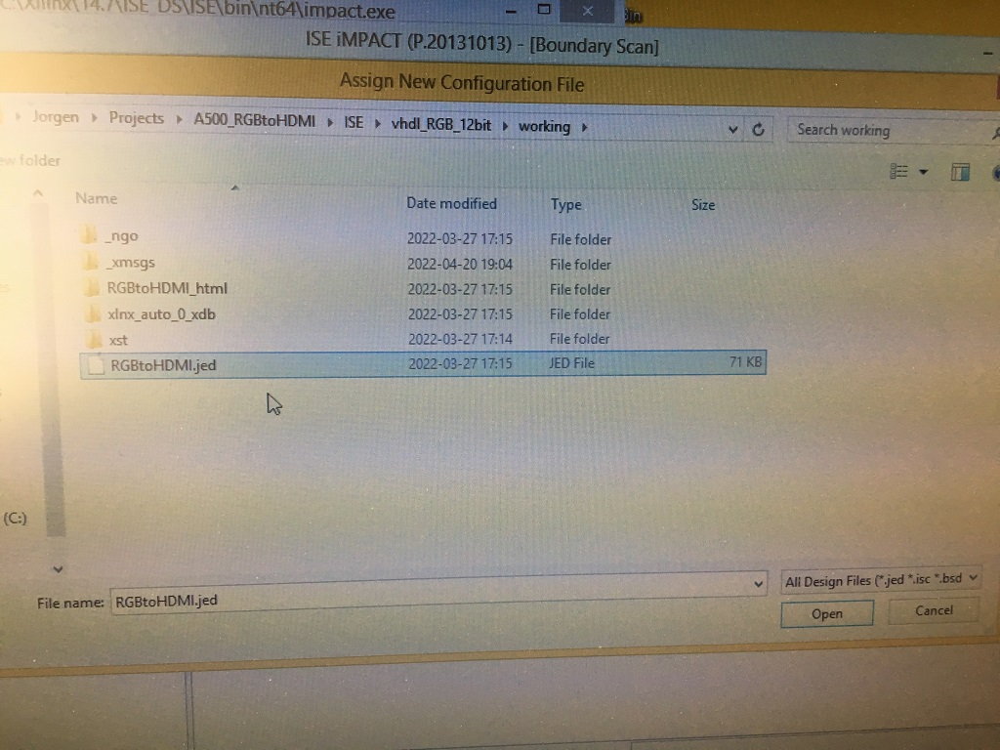

# A500_RGBtoHDMI
My RGBtoHDMI-adapter-board design for A500.

***

 

***

 

***

 

***

### Build

 

 

 

 

 

 

***

Video:  

https://drive.google.com/file/d/1ksP-LVyoxUxEtZK_JW-vs8qUCuZv387j/view?usp=sharing

***

### RPi Zero configuration

Follow the instructions here:

https://github.com/hoglet67/RGBtoHDMI/wiki/Quick-Start-Guide#installing-the-software

...and then...

To auto configure for correct profile and operation with single button, copy the files in the appropriate Amiga folder into the root folder, overwriting any existing files.

***

BOM Rev. 1A
---------
Position  | Name/Value   | Package | Notes
-|-|-|-|
U1 | 2x24 Round Female Pin Header Connector | 1x40 2.54mm pitch | Cut down to 2x24 Pin for socketing Denise
U2 | XC9572XL-10VQ64 | VQFP-64 | Xilinx 72-mc CPLD 52 I/O
U3 | LM1117-3.3 or AMS1117-3.3 | SOT-223 | 3.3V 1A Low Drop-Out (LDO) Voltage regulator.
U4 | 2x24 Single Row Male Pin Connector Strip | 1x40 2.54mm pitch | Cut down to 2x24 Pin
R1 | 1k | 0805 | Pull-down resistor (SPDATA)
R2 | 4.7k | 0805 | Pull-down resistor (DETECT)
C1 | 10uF | 1206 | 5V Decoupling capacitor
C2 | 10uF | 1206 | 3V3 Decoupling capacitor
C3 | 0.1uF = 100nF | 0805 | 3V3 Decoupling capacitor
C4 | 0.1uF = 100nF | 0805 | 3V3 Decoupling capacitor
C5 | 0.1uF = 100nF | 0805 | 3V3 Decoupling capacitor
C6 | 0.1uF = 100nF | 0805 | 3V3 Decoupling capacitor
JTAG | JTAG Pin Header | 2.54mm pitch | (Optional) Hold JTAG-header against holes while programming is enough.
PWR | VCC/GND-header | 2.00mm pitch | A 2.54mm two-pin header fits surface mounted on pads

***

Happy Hackin'
